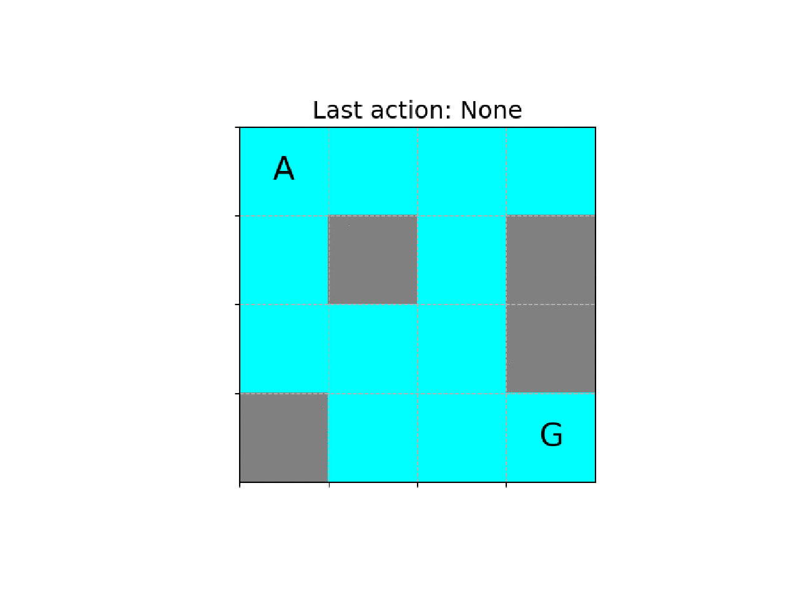

# gym-flmpl
This environment is modified version of [FrozenLake environment](https://gym.openai.com/envs/FrozenLake-v0/).  
The environment can be rendered visually by matplotlib.

# Installation
```bash
cd gym-flmpl
pip install -e .
```

# How to use
```python
import gym
import gym-flmpl
from time import sleep

env = gym.make("FrozenLakeMpl-v0")
env.reset()
env.verbose = True
env.render(mode='mpl')
sleep(1)
```

# Demo

